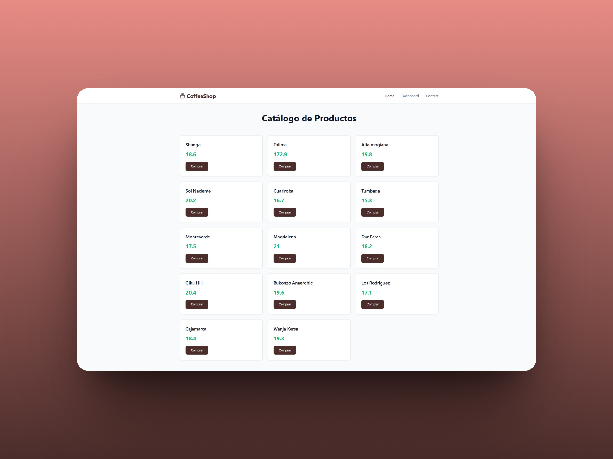
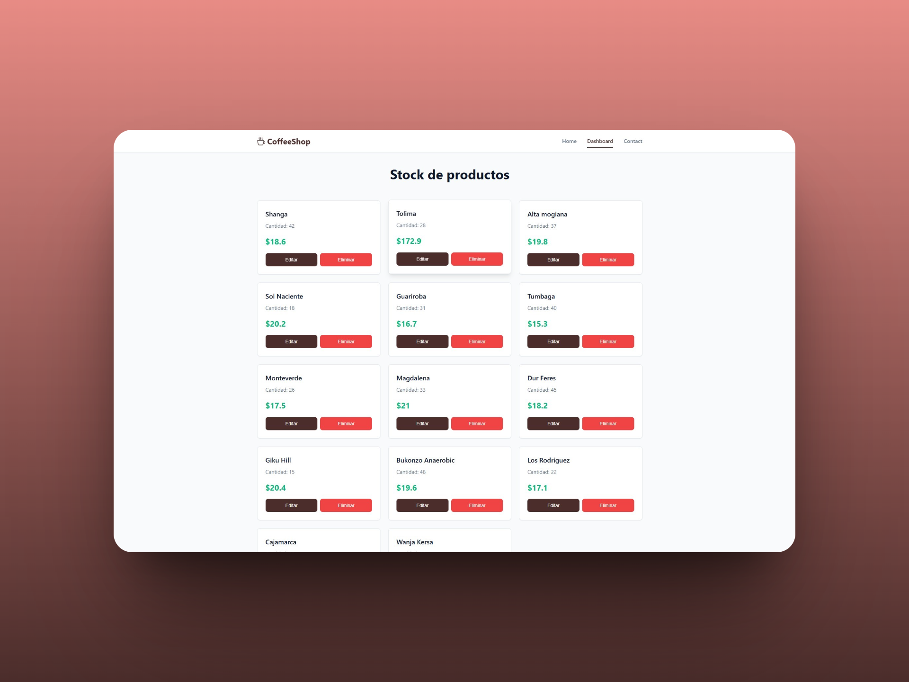

# Coffee Shop - React ☕

## 🧠 Descripción

Frontend desarrollado en React para la tienda online Coffee Shop. Proporciona una interfaz moderna, responsive y sencilla que permite explorar productos, gestionar un carrito y visualizar estadísticas en un dashboard.

## ⚙️ Funcionalidad

- **Home**:
  - Vista de productos a través de APIs.
  - Registro datos de usuario en cada compra.

- **Dashboard**:
  - Crear, obtener, actualizar y eliminar productos.
  - Validación de datos en creación y actualización.

- **Contact**:
  - Información del creador.

## 🛠️ Tecnologías usadas

- **ReactJS** como front-end.

## 📁 Estructura del proyecto

```
NEOLAND-PROYECTO-SERVER/
│
├── public/
│
├── src/
│   ├── Components/
│   ├── context/
│   ├── pages/
│   ├── App.jsx
│   ├── App.jsx
│   ├── index.css
│   └── views/
├── .env-example
├── package.json
└── README.md
```

## 🚀 Instalación y puesta en marcha

1. Clona el repositorio:
   ```
   git clone https://github.com/davidrguez98/Neoland-Proyecto-ReactJS
   cd Neoland-Proyecto-ReactJS
   ```

2. Instala las dependencias:
   ```
   npm install
   ```

4. Inicia el servidor en modo desarrollo:
   ```
   npm run dev
   ```

## 📸 Capturas de pantalla




## 🤝 Contacto

Si quieres ponerte en contacto conmigo:

- [GitHub](https://github.com/davidrguez98)
- [LinkedIn](https://www.linkedin.com/in/david-rodr%C3%ADguez-p%C3%A9rez-softdev/)
- Correo: ropeda98@gmail.com
